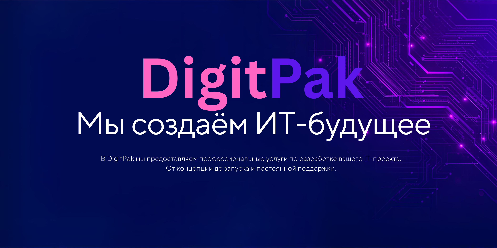

  
  <!-- Баннер -->
  

  <!-- Кнопки связи -->
  

    
    
    
  

  <!-- Статистика -->
  

    
    
    
    
  

  <!-- Главный заголовок -->
  <h1>🚀 Мы создаём ИТ-будущее</h1>

  <!-- Описание компании -->
  <h3>⚡ DigitPak — ваш эксклюзивный партнер в мире цифровых технологий</h3>
  
  
<i>Мы не просто создаем сайты – мы создаем инструменты для роста вашей компании. Успех клиента – это наш успех. Поэтому каждый проект мы делаем так, будто это наш собственный бизнес.</i>

  
В DigitPak мы предоставляем комплексные услуги по разработке вашего ИТ-проекта. От концепции до запуска и постоянной поддержки. Помогаем бизнесу доминировать в цифровом пространстве.

   

  <!-- Кнопка "Заказать проект" -->
  
  

   
   

  <!-- Миссия -->
  <h2>🎯 Наша миссия</h2>
  <blockquote>
    <i>"Мы объединяем технологии и креатив, чтобы создавать продукты, которые меняют правила игры на рынке. Наш опыт позволяет решать задачи любой сложности."</i>
  </blockquote>

   

  <!-- Услуги -->
  <h2>⚙️ Наши компетенции</h2>

  <table>
    <tr>
      <td width="33%" align="center">
        <h3>🌐 Веб-разработка</h3>
        
Создаем высоконагруженные платформы, интернет-магазины и корпоративные сайты с уникальным дизайном.

        <a href="https://ваш-сайт.ru/web">→ Заказать</a>
      </td>
      <td width="33%" align="center">
        <h3>📈 SEO Продвижение</h3>
        
Выводим ваш бизнес в ТОП поисковых систем, увеличивая органический трафик и конверсию.

        <a href="https://ваш-сайт.ru/seo">→ Заказать</a>
      </td>
      <td width="33%" align="center">
        <h3>🎨 UX/UI Дизайн</h3>
        
Проектируем интерфейсы, которые влюбляют пользователей и решают бизнес-задачи.

        <a href="https://ваш-сайт.ru/design">→ Заказать</a>
      </td>
    </tr>
    <tr>
      <td width="33%" align="center">
        <h3>💻 ПО и Сервисы</h3>
        
Разработка кастомных CRM, ERP систем и мобильных приложений под ваши нужды.

        <a href="https://ваш-сайт.ru/software">→ Заказать</a>
      </td>
      <td width="33%" align="center">
        <h3>🔒 Кибербезопасность</h3>
        
Защищаем ваши данные и инфраструктуру от внешних угроз и взломов 24/7.

        <a href="https://ваш-сайт.ru/security">→ Заказать</a>
      </td>
      <td width="33%" align="center">
        <h3>🧠 ИТ-Консалтинг</h3>
        
Помогаем оптимизировать ИТ-инфраструктуру и внедрять инновации для роста бизнеса.

        <a href="https://ваш-сайт.ru/consulting">→ Заказать</a>
      </td>
    </tr>
  </table>

   

  <!-- Решения для масштабирования -->
  <h2>📊 Решения для масштабирования</h2>
  
<i>Мы объединяем технологии и креатив, чтобы создавать продукты, которые меняют правила игры на рынке.</i>

   

  <!-- Проекты (если есть что показать) -->
  <h2>🔥 Наши последние проекты</h2>

  <table>
    <tr>
      <td align="center">
        
      </td>
      <td align="center">
        
      </td>
    </tr>
  </table>

   

  <!-- Технологии -->
  <h2>🛠️ Технологии, с которыми мы работаем</h2>
  

    
    
    
    
    
    
  

   

  <!-- CEO -->
  <h2>👨‍💼 Руководство</h2>
  
<b>CEO DigitPak</b> — команда профессионалов с 15-летним опытом

   
   

  <!-- Контакты -->
  <h2>📞 Свяжитесь с нами</h2>
  

    <a href="https://digitpak24.ru">🌐 www.digitpak24.ru</a> |
    <a href="mailto:info@digitpak.ru">✉️ artex@ya.ru</a> |
    <a href="telegram:@digitpak_bot">📞 @digitpak_bot</a>
  

   

  <!-- Лицензия -->
  
© 2026 DigitPak. Все права защищены.

